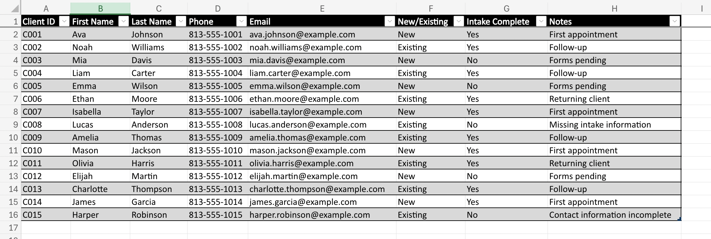
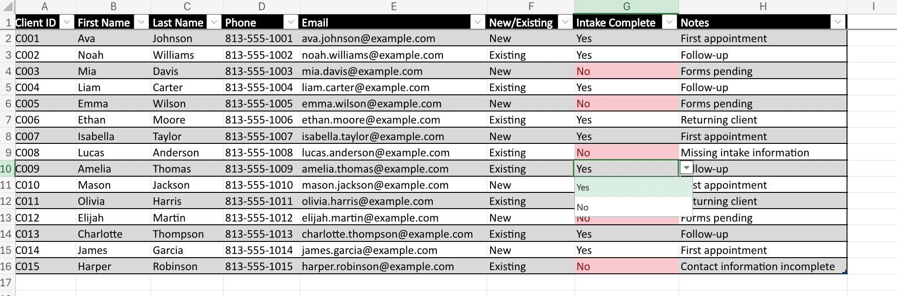
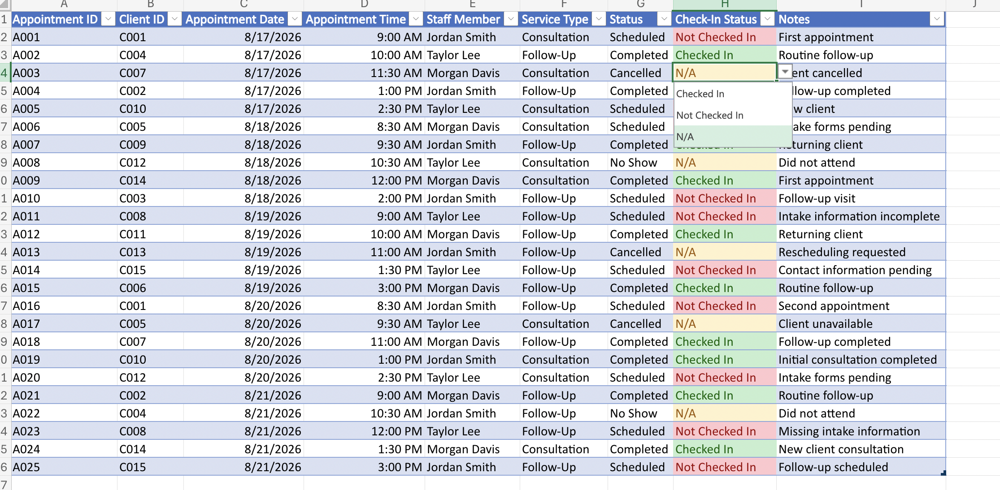
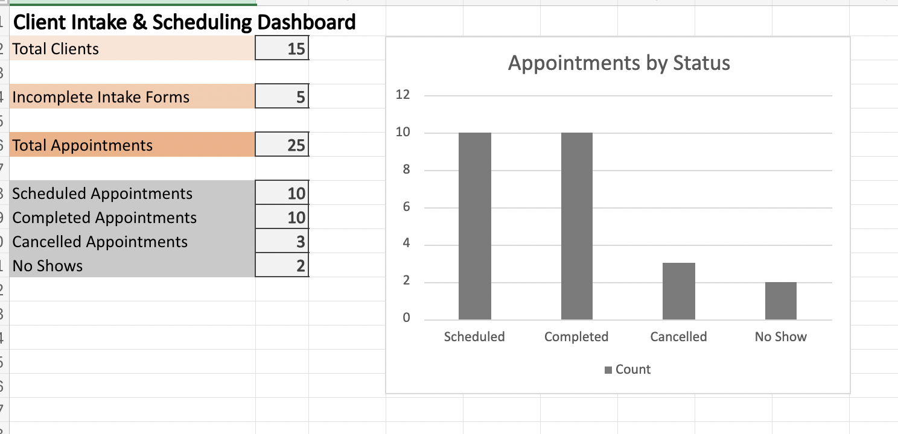

# Client Intake & Scheduling Tracker

## Overview

This project is an Excel-based client intake and appointment scheduling system designed to simulate administrative workflow management.

The workbook organizes fictional client information, tracks appointments and intake completion, and provides a dashboard for monitoring scheduling activity.

All client information used in this project is fictional and was created solely for demonstration purposes.

## Features

- Client intake record management
- Appointment scheduling and tracking
- Data validation dropdown menus
- Conditional formatting for incomplete records
- Appointment status tracking
- Automated summary calculations
- Scheduling dashboard
- Appointment status visualization

## Skills Demonstrated

- Microsoft Excel
- Data Validation
- Conditional Formatting
- COUNTIF and COUNTA
- IF Functions
- Data Organization
- Record Management
- Appointment Scheduling
- Dashboard Reporting

## Client Intake Table

## Data Validation & Intake Tracking

## Appointment Scheduling Tracker

## Scheduling Dashboard

